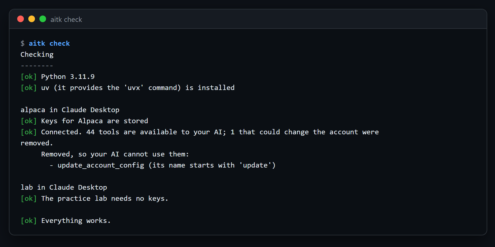
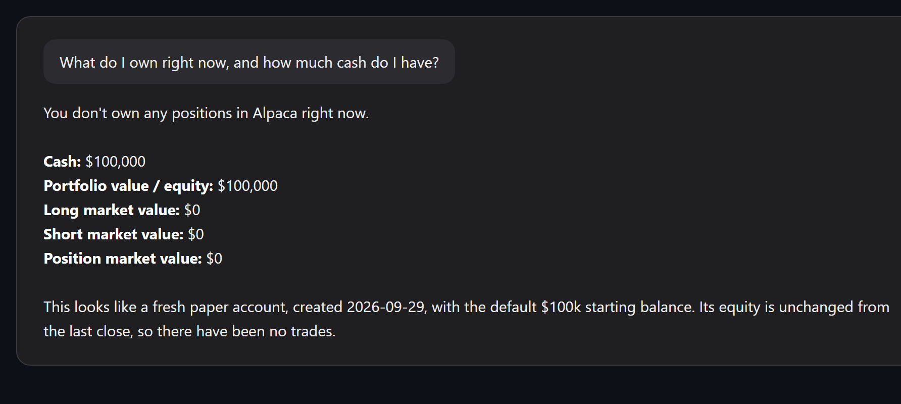
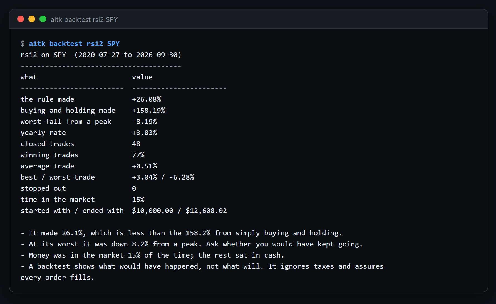
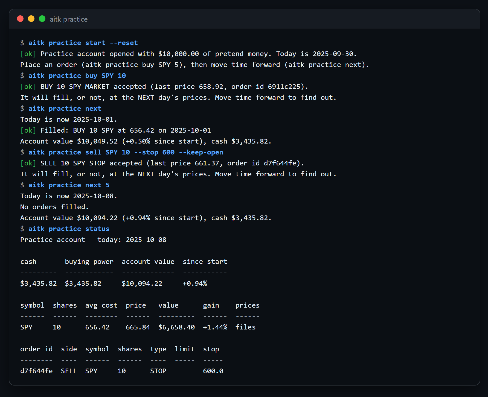
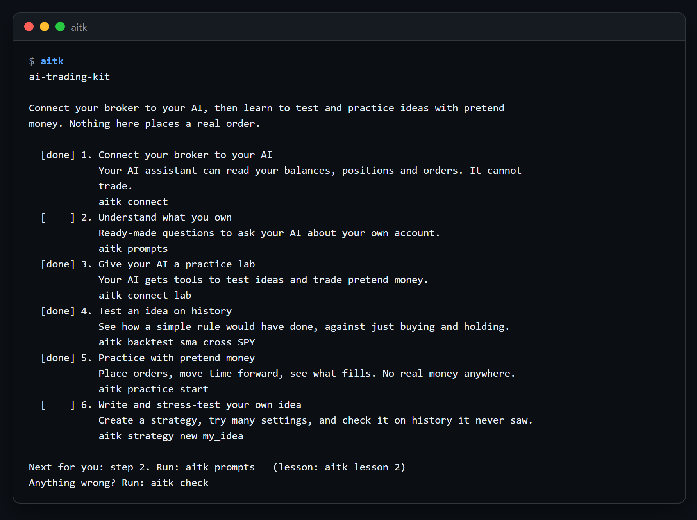
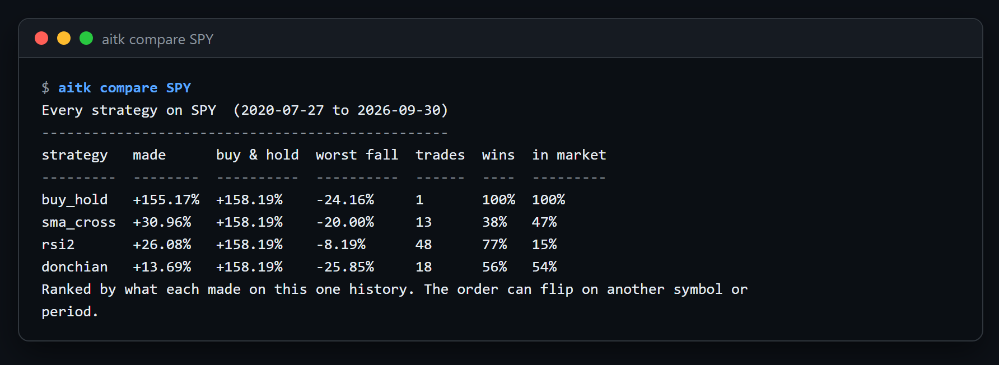
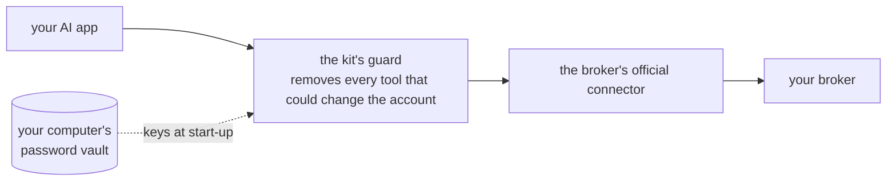

# ai-trading-kit

**Connect your brokerage to your AI assistant in a few minutes, then learn to test and practice
trading ideas with pretend money.** Read-only by design. Nothing in this kit can place a real order.


```
git clone https://github.com/Dimas-100/ai-trading-kit.git
cd ai-trading-kit
start            # Windows: double-click start.bat, or run it
./start.sh       # macOS / Linux
```

That installs the kit into its own folder and shows the path below. Every step is one command and
one short lesson.

## The path

| Step | You get | Command |
|---|---|---|
| 1. Connect | Your AI can read your balances, positions and orders. It cannot trade. | `aitk connect` |
| 2. Understand | Ready-made questions to ask your AI about your own account. | `aitk prompts` |
| 3. Lab | Your AI gets tools to test ideas and trade pretend money. | `aitk connect-lab` |
| 4. Test | See how a rule would have done, against just buying and holding. | `aitk backtest sma_cross SPY` |
| 5. Practice | Place orders, move time forward, see what fills. No real money anywhere. | `aitk practice start` |
| 6. Your own | Write a strategy, try many settings, check it on history it never saw. | `aitk strategy new my_idea` |

Run `aitk` with no arguments any time to see where you are on the path. `aitk lesson 1` prints a
step's lesson; `aitk check` re-tests every connection and says what to fix.

## What it looks like

A real run with a free Alpaca paper account, from the connection test to a question answered in Claude Desktop.

`aitk check` starts the connector the way the AI app will and shows what the guard removed:



Then, in Claude Desktop:



A backtest on real SPY prices, with buy-and-hold as the yardstick and the cautions spelled out:



The practice account: place an order, move time forward, see what filled:



<details>
<summary>More: the home screen and the strategy comparison</summary>





</details>

## Who this is for

- **Never traded, curious what an AI can tell you about your account.** Do steps 1 and 2. Stop there
  if you like; they are useful on their own.
- **Have an idea and want to know if it would have worked.** Steps 3 and 4 give you an honest
  backtest with buy-and-hold as the yardstick and the cautions spelled out.
- **Know what overfitting is and want tooling that respects it.** Step 6: your own strategy file,
  a settings sweep that chooses on the first part of history and judges on the last, and a practice
  account that fills at the next day's prices.

## Not a trader? It still helps

Most people's money sits in index funds and a retirement account. Steps 1 and 2 are for them:
connect, then ask `retirement-check` (am I on track?), `fees-check` (what am I paying?),
`monthly-checkin` (a look in the mirror) and `all-my-accounts` (several brokers in one view). No
trading required, and no advice given: numbers first, then what they mean.

## Your AI can guide the setup

Once the lab is connected (step 3), you can ask your AI "where am I on the path?", "help me connect
Fidelity" or "check my connections". It knows every broker, hands you the exact command, and re-tests
what you set up. It is told never to ask for a key in the chat; keys are typed only into the wizard
in your own terminal.

## Brokers

The kit sets up each broker's **official** connector and never uses tools that log in with your
password (they break most brokers' terms). Where the kit starts the connector itself, its guard
removes every tool that could change your account before your AI ever sees it.

| Broker | Effort | How it is kept read-only |
|---|---|---|
| Alpaca | easy, free practice account | enforced by the kit |
| Tradier | easy, free practice account | enforced by the kit |
| Public | easy | enforced by the kit |
| Webull (own API keys) | 1 to 2 day approval | enforced by the kit |
| Webull (sign in) | easy | you choose read-only permissions while signing in |
| Kraken (crypto) | medium, macOS/Linux | enforced by the kit |
| Coinbase (crypto) | easy | you choose read-only permissions while signing in |
| SnapTrade: Fidelity, Schwab, Vanguard, Robinhood, IBKR and more | easy, free | read-only by the connector's design |
| Robinhood (direct) | easy | **not read-only**; the wizard warns you |
| Moomoo | easy | **not read-only**; the wizard warns you |

`aitk brokers` prints the full list, `aitk brokers fidelity` explains what is possible for a broker.
Interactive Brokers, TradeStation and tastytrade are listed with advice but not set up by the wizard
yet. Fidelity, Vanguard, Schwab, E*TRADE, Merrill, SoFi and Firstrade offer no official connector;
SnapTrade reads them.

## AI apps

Claude Desktop, Claude Code and Cursor: the kit writes the connection for you, after a backup of the
settings file, and never puts a key in it. ChatGPT keeps connections in its own settings screen, so
the kit prints the exact steps; ChatGPT can use only the sign-in brokers.

## How a connection works



- Your keys live in the operating system's password vault. They are never in this folder and never
  in an AI app's settings file, and the kit never prints them.
- `aitk check` starts the connector the same way your AI app does, asks it which tools it offers and
  shows which ones were removed. Alpaca's connector offers 45 tools: 44 reads pass and the one that
  changes settings is removed. Public's offers 37: 27 pass and all 10 order tools are removed.
- Where a broker's connector cannot be held to read-only (Robinhood, Moomoo), the wizard says so
  before going on and asks you to confirm.

## The lab

`aitk connect-lab` gives your AI a second connection: the kit's own practice lab. Its tools test
ideas on price history and trade a pretend-money account on your computer. It has no connection to
any broker.

```
aitk prices key                    # once: a free price-data key (Tiingo or Alpaca)
aitk prices get SPY QQQ            # ~20 years of daily prices, kept on your computer
aitk backtest rsi2 SPY --trades    # one rule, with the trade list
aitk compare SPY                   # every rule side by side
aitk sweep sma_cross SPY fast=10,20,50 slow=100,200
aitk practice start && aitk practice buy SPY 5 && aitk practice next
```

Until you download prices, every command runs on made-up demo prices and says so. Built-in
strategies: `buy_hold` (the benchmark), `sma_cross`, `rsi2`, `donchian`. Your own go in the kit's
home folder as one Python file each (`aitk strategy new NAME` writes a template).

Every backtest ends with a **reality check**: the longest stretch you would have sat below a previous
peak, the worst run of losing trades, and the biggest single loss in dollars. Those end more
strategies than bad returns do.

**Live through a hard year.** `aitk practice start --scenario 2022-bear` begins the practice account
in January 2022 (also `2020-crash`, `2023-rally`, `2025-tariffs`). Move a week at a time, decide each
time, then `aitk practice report` shows how you did against simply holding, with a verdict.

## What this kit refuses to do

- Place, change or cancel a real order. There is no code path for it, and the tests check that the
  lab's only state-changing tools are the practice ones and the price download.
- Store a key in the repository or in an AI app's settings.
- Use unofficial, password-scraping broker libraries.
- Tell you what to buy. Every result comes with the cautions a careful person would want.

## Manual install

```
python -m venv .venv
.venv/Scripts/python -m pip install -e .        # Windows
.venv/bin/python -m pip install -e .            # macOS / Linux
aitk
```

Python 3.11 or newer. The kit's own files live in `~/.ai-trading-kit` (set `AITK_HOME` to move them).
Broker connectors that run locally need [uv](https://docs.astral.sh/uv/) for `uvx`; the wizard tells
you when.

## Project layout

```
src/aitk/
  cli.py                 the aitk command
  connect/               step 1: recipes/*.toml (one per broker), apps.py (AI app adapters),
                         guard.py (the read-only guard), launcher.py, doctor.py, wizard.py
  engine/                bars, indicators, strategies, one fill model, practice broker, backtest
  lab.py                 backtests with plain-words verdicts; the settings sweep
  practice.py            the pretend-money account with its own calendar
  prices.py              price files, demo prices, downloads (Tiingo, Alpaca)
  mcp/                   a small MCP implementation (server + client) and the lab server
  guide/                 the six steps, their lessons and the prompt library
tests/                   no network, a fake broker connector, every adapter against a temp home
docs/                    design, safety model, how to add a broker
```

## Contributing

Adding a broker is adding one TOML file: see `docs/adding-a-broker.md`. Every recipe records the date
its facts were last checked against the broker's own pages and how confident that check was.

## Disclaimer

This is a personal project shared as a reference. Nothing in it is financial advice. Backtests show
what would have happened, not what will. If you ever trade real money, do it at your broker, start
small, and decide your exit before you enter.

MIT licensed.
